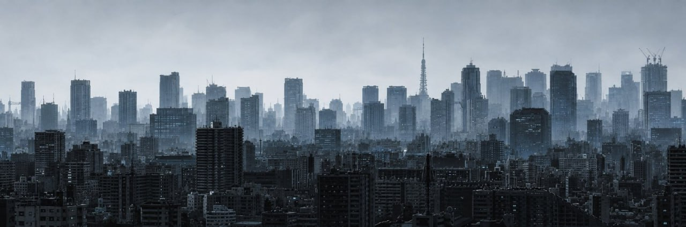

  

<table>
<tr>
<td valign="top" width="62%">

**MIKADZYKI** — onchain, NFTs, content.

I live on the timeline and on the tape. Collections, mints, the rooms where a call actually goes somewhere — and the receipts after, when the hype is gone and only the chain remembers what happened.

What I post is what I hold. What I build is what I needed and nobody shipped. No paid groups, no signal service, no "DM me". The work is public or it is not real.

Lately that means writing tools instead of threads about tools: the desk I run reads the chain directly, counts everything exactly, and answers the only question that matters after a pump — **where did the money go**.

### What I run now

- **X** — [@Mikadzyki_NFT](https://x.com/Mikadzyki_NFT) — daily, the takes and the calls
- **the tape** — onchain flow, wallets, who sold into whom
- **desks** — tools shipped in public: [GHOST](https://github.com/0xmikadzyki/ghost) — fund-flow explorer pipeline, read-only, no keys

### Stack I actually touch

</td>
<td valign="top" width="38%" align="center">

  

 

onchain since the last cycle

NFTs, flow, the timeline

tools shipped in public

</td>
</tr>
</table>
